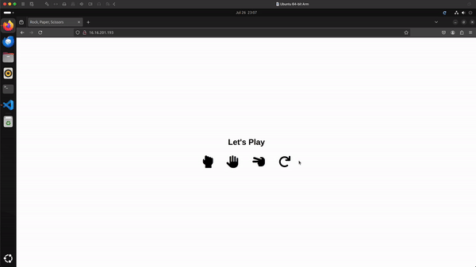

# Deploying a Flask Rock, Paper, Scissors App to AWS EC2 with DevOps Tools

  

[](https://www.linux.org/) [](https://aws.amazon.com/) [](https://www.terraform.io/)

 


[](https://github.com/sohailsajid79/flask-ec2-docker-devops/actions/workflows/deploy.yaml)

## Table of Contents

1. [Project](#project)
2. [Architecture](#architecture)

   - [Overview](#overview)
   - [AWS Infrastructure Deployed by Terraform](#aws-infrastructure-deployed-by-terraform)
   - [Docker Containerisation](#docker-containerisation)
   - [Workflow](#workflow)
     - [Setup Job](#setup-job)
     - [Deploy Job](#deploy-job)

3. [Accessing the Application](#accessing-the-application)
4. [Troubleshooting](#troubleshooting)
5. [Destroying Infrastructure](#destroying-infrastructure) 🚨

## Project

The project demonstrates the deployment of a simple Flask web application that hosts a Rock, Paper, Scissors game. The application is containerised using Docker and deployed to an AWS EC2 instance. The setup leverages modern DevOps tools, including Terraform for infrastructure provisioning and GitHub Actions for CI/CD automation.

The application is a basic Flask web app built with HTML and Flask - a micro web framework written in Python. The users can play Rock, Paper, Scissors against the computer and each time a user makes a choice, the application randomly selects the computer's choice and determines the winner.



## Architecture

### Overview

The diagram integrates the local development environment, GitHub repository and Actions workflow, and AWS infrastructure to show the entire flow from code development to deployment on AWS EC2 instance.


### AWS Infrastructure Deployed by Terraform

**Infrastructure as Code**: Terraform was used to provision the required AWS infrastructure. The setup provided a secure and scalable environment for our containerised application. The Terraform configuration provisions the following resources:

- **Required Provider:** we specify the provider version for our AWS infrastructure with the version 5.59.0. For more details, refer to the [AWS Provider Documentation](https://registry.terraform.io/providers/hashicorp/aws/5.59.0).
- **VPC:** this is the top-level network container where all other resources are hosted. We define a CIDR block of 10.0.0.0/16: CIDR is a method for allocating IP addresses for IP routing to the internet or private internall network.
- **Subnet:** the public subnet within the VPC is allocated a CIDR block of 10.0.1.0/24 where our EC2 instance is launched.
- **Internet Gateway:** we attach internet gateway to the VPC for internet access to our EC2 insance.
- **Route Table:** we configure a route table to direct traffic from the subnet to the internet via the internet gateway.
- **Security Group:** we allow inbound SSH and HTTP traffic to our EC2 instance from ports 22 and 80.
- **EC2 Instance:** our virtual server running the dockerised Flask application is assigned Public IP 16.16.201.193 for accessibility. Since our setup involved deploying a simple Flask application, we opted for a t3.micro (free tier) instance for our EC2 setup.
- **AWS Key Pair (`ssh_key`):** this is used for SSH access to our AWS EC2 instance.


### Docker Containerisation

**Containerisation**: The Flask application hosted on our AWS EC2 instance is containerised using Docker, which streamlined the deployment process and allowed us to build the Docker image for the Flask application:

```
# Use the official Python image from the Docker Hub
FROM python:3.8-slim

# Set the working directory
WORKDIR /app

# Copy the requirements.txt file into the container
COPY requirements.txt .

# Install the required packages
RUN pip install -r requirements.txt

# Copy the rest of the application code into the container
COPY . .

# Expose the port the app runs on
EXPOSE 8080

# Run the application
CMD ["python", "app.py"]
```

```
docker build -t flask-app .
```

```
docker run -d -p 8080:8080 flask-app
```

### Workflow

**CI/CD Pipeline**: The GitHub Actions workflow automates the deployment of the Dockerised Flask application to our AWS EC2 instance. The workflow is defined in the `.github/workflows/deploy.yml` file. It is initiated manually with the `on: workflow_dispatch` event and we trigger the workflow from the GitHub UI, providing us with greater control over when it runs, as opposed to automatically triggering on every push event.

The workflow handles secure SSH setup, file transfer to our AWS EC2 instance, Docker image building, and container management. We utilised caching to expedite the deployment process by reusing Docker layers. The workflow's separation into distinct Setup and Deploy jobs ensures modularity and ease of management.

#### Setup Job:

The `runs-on: ubuntu-latest` specifies our runner environment as Ubuntu, which is a virtual machine hosted by GitHub. The `actions/checkout@v4` is used to check out the repository's code to the runner. We leverage `webfactory/ssh-agent@v0.9.0` from the GitHub Actions Marketplace to set up the SSH agent with the private key stored in our GitHub secret `SSH_PRIVATE_KEY` 🔑. This key is used to establish a secure SSH connection to our AWS EC2 instance. We execute the SSH command to create the `/home/ubuntu/flask-app` directory on our AWS EC2 instance:

```
- name: Create remote directory
  run: |
    ssh -o StrictHostKeyChecking=no ubuntu@${{ secrets.EC2_PUBLIC_IP }} "mkdir -p /home/ubuntu/flask-app"
```

ℹ️ We then use the `scp` command to securely copy the application files to our AWS EC2 instance. The `*` wildcard is used to match all files and directories in the current directory ℹ️.

```
- name: Copy files to EC2
    run: |
      scp -o StrictHostKeyChecking=no -r * ubuntu@${{ secrets.EC2_PUBLIC_IP }}:/home/ubuntu/flask-app
```

#### Deploy Job

The deploy job depends on the successful completion of the setup job (`needs: setup`). We re-establish an SSH connection using the SSH key. The `actions/cache@v2` action is used to cache Docker layers, speeding up subsequent builds by reusing unchanged layers. The cache is stored based on a unique key generated from the Dockerfile contents:

```
- name: Cache Docker layers
    uses: actions/cache@v2
    with:
      path: /home/runner/.cache/docker
      key: ${{ runner.os }}-docker-${{ hashFiles('**/Dockerfile') }}
      restore-keys: |
      ${{ runner.os }}-docker-
```

Once SSH'd into our AWS EC2 instance, we navigate to the application directory (`/home/ubuntu/flask-app`), build the Docker image (`flask-app`) from the Dockerfile, stop and remove any existing Docker container, and run a new Docker container with the newly built image, mapping port 80 on the host to port 8080 in the container, making the application accessible via the public IP of the EC2 instance:

```
- name: SSH into EC2 and deploy
    run: |
      ssh -o StrictHostKeyChecking=no ubuntu@${{ secrets.EC2_PUBLIC_IP }} << 'EOF'
        cd /home/ubuntu/flask-app
        docker build -t flask-app .
        docker stop flask-app || true
        docker rm flask-app || true
        docker run -d -p 80:8080 --name flask-app flask-app
      EOF
```

### Accessing the Application

Once the `Deploy to EC2` workflow is complete, the Flask application will be running inside a Docker container on our AWS EC2 instance. The application can be accessed via the public IP address of the EC2 instance:

ℹ️ The public IP address of the EC2 instance is typically provided in the output of the Terraform apply command or can be found in the AWS Management Console under the EC2 instance details. ℹ️

```
http://16.16.201.193/
```

### Troubleshooting

During the deployment of the Flask Rock, Paper, Scissors application to AWS EC2, several issues were encountered. Here are the main challenges and their solutions:

1. Invalid AMI ID Error
   `Issue: The error message InvalidAMIID.NotFound: The image id '[ami-07c8c1b18ca66bb07]'` does not exist was encountered.

   **Solution**: This issue was resolved by selecting an appropriate and valid AMI ID for the chosen AWS region (eu-north-1). AMI IDs are region-specific, so using an AMI ID from another region will result in this error.

2. No Matching EC2 VPC Found
   Issue: The error `no matching EC2 VPC found`, indicating that the default VPC was not found.

   **Solution**: We decided to create a new VPC as part of the Terraform configuration. The VPC, along with its associated resources (subnet, Internet Gateway, route table, etc.), was explicitly defined to ensure consistent infrastructure setup.

3. Docker Permissions Error
   Issue: The error `permission denied while trying to connect to the Docker daemon socket at unix:///var/run/docker.sock` was encountered, preventing Docker commands from executing.

   **Solution**:
   We discovered the user was not added to the docker group, causing permission issues. This was resolved by adding the ubuntu user to the docker group on our AWS EC2 instance using the command:

   ```
   sudo usermod -aG docker $USER
   ```

   The EC2 instance needed to be rebooted for the changes to take effect, or the user had to log out and back in.

### Destroying Infrastructure

We destroyed the infrastructure to avoid incurring charges once the project was complete:

```
terraform destroy
```
