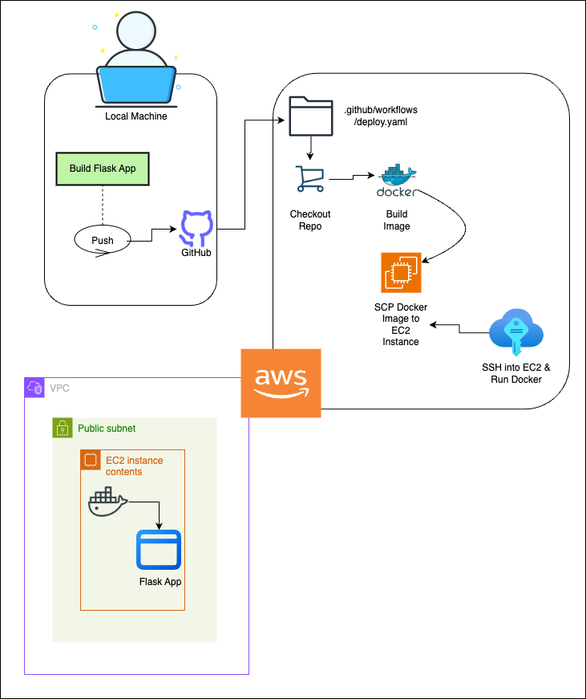
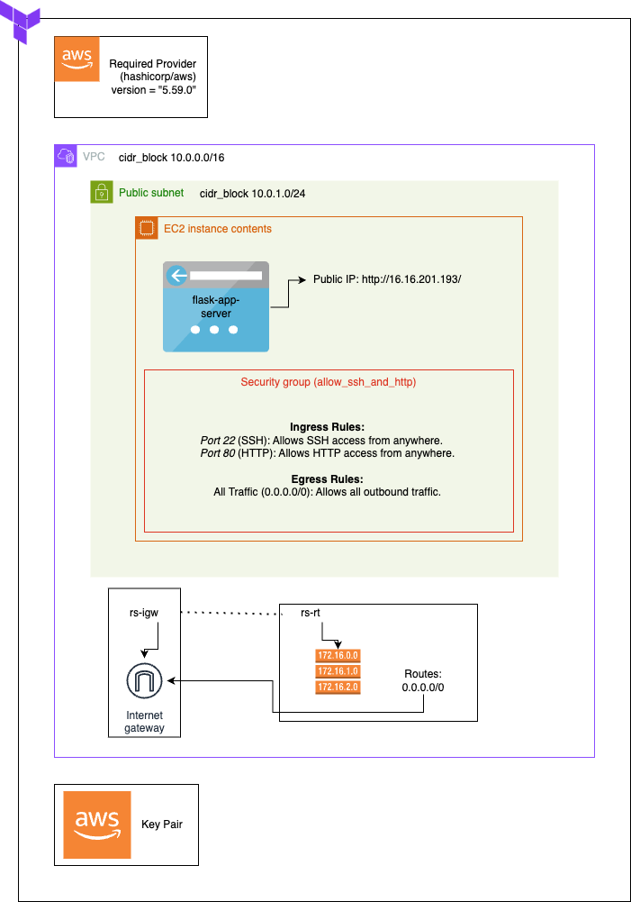

# Deploying a Flask Rock, Paper, Scissors App to AWS EC2 with DevOps Tools

  

  

 

## Table of Contents

1. [Project](#project)
2. [Architecture](#architecture)

   - [Overview](#overview)
   - [AWS Infrastructure Deployed by Terraform](#aws-infrastructure-deployed-by-terraform)
   - [Docker Containerisation](#docker-containerisation)
   - [GitHub Actions CI/CD Workflow](#gitHub-actions-ci/cd-workflow)
     - [Setting Up Secrets in GitHub](#setting-up-secrets-in-github) 🔑
     - [Running the Workflow](#running-the-workflow)

3. [Accessing the Application](#accessing-the-application)
4. [Troubleshooting](#troubleshooting)
5. [Destroying Infrastructure](#destroying-infrastructure) 🚨

## Project

The project demonstrates the deployment of a simple Flask web application that hosts a Rock, Paper, Scissors game. The app is containerised using Docker and deployed to an AWS EC2 instance. The setup leverages modern DevOps tools, including Terraform for infrastructure provisioning and GitHub Actions for CI/CD automation.

The application is a basic Flask web app built with HTML and Flask - a micro web framework written in Python. The users can play Rock, Paper, Scissors against the computer and each time a user makes a choice, the app randomly selects the computer's choice and determines the winner.

## Architecture

### Overview

The diagram integrates the local development environment, GitHub repository and Actions workflow, and AWS infrastructure to show the entire flow from code development to deployment on AWS EC2.

### AWS Infrastructure Deployed by Terraform

**Infrastructure as Code**: Terraform is used to provision the required AWS infrastructure. The setup provides a secure and scalable environment for deploying containerised applications using AWS and Terraform.

The Terraform configuration provisions the following resources:

- Required Provider: we specify the provider version for our AWS infrastructure with the version 5.59.0. For more details, refer to the [AWS Provider Documentation](https://registry.terraform.io/providers/hashicorp/aws/5.59.0).
- VPC: this is the top-level network container where all other resources are hosted. We define a CIDR block of 10.0.0.0/16: CIDR is a method for allocating IP addresses for IP routing to the internet or private internall network.
- Subnet: the public subnet within the VPC is allocated a CIDR block of 10.0.1.0/24 where the EC2 instance is launched.
- Internet Gateway: we attach internet gateway to the VPC for internet access to our EC2 insance.
- Route Table: we configure a route table to direct traffic from the subnet to the internet via the internet gateway.
- Security Group: we allow inbound SSH and HTTP traffic to the EC2 instance from ports 22 and 80.
- EC2 Instance: our virtual server running the dockerised Flask application is assigned Public IP 16.16.201.193 for accessibility.
- AWS Key Pair (ssh_key): this is used for SSH access to the EC2 instance.

### Docker Containerisation

**Containerisation**: The Flask app hosted on AWS EC2 is containerised using Docker, which simplifies deployment and provides the flexibility to choose an instance type based on the required compute power. Our setup allows for easy scaling as needed. We used a t3.micro instance for our EC2.

### GitHub Actions CI/CD Workflow
