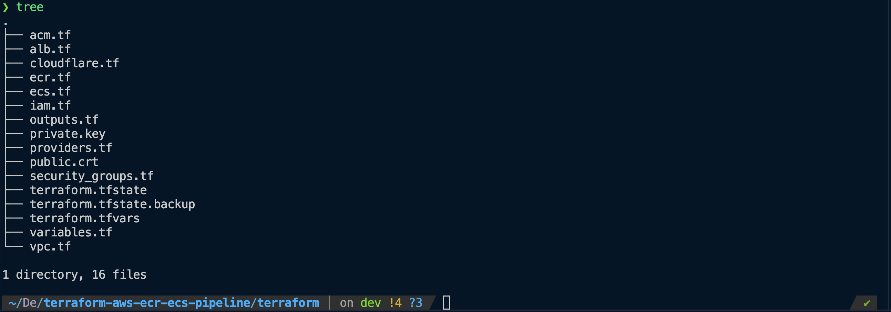
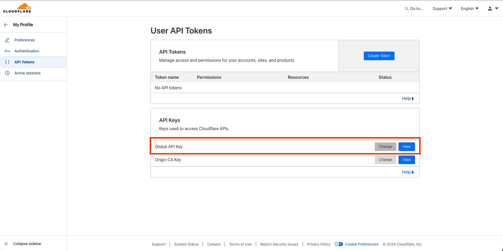

# Terraform AWS ECR ECS ALB Pipeline

This project provides an end-to-end solution for deploying a containerised application using AWS services. The pipeline utilises **Terraform** to provision and manage infrastructure on AWS, including **ECR**, **ECS**, **ALB**, and **Cloudflare** for DNS management. It includes a **CI/CD** pipeline to automate the build and deployment of the Dockerised application using **GitHub Actions**.

# Table of Contents

1. [Project Overview](#project-overview)
2. [Architecture](#architecture)
3. [Prerequisites](#prerequisites)
4. [Project Structure](#project-structure)
5. [Setup Instructions](#setup-instructions)

   - [Clone Repository](#clone-repository)
   - [Configuration](#configuration)
   - [Initialise Terraform](#initialise-terraform)
   - [Deploy Infrastructure](#deploy-infrastructure)
   - [Clean Up](#clean-up)

6. [SSL/TLS Certificate Setup](#ssltls-certificate-setup)
7. [Variables](#variables)
8. [Outputs](#outputs)
9. [CI/CD with GitHub Actions](#cicd-with-github-actions)
10. [Contributing](#contributing)
11. [License](#license)

## Project Overview

This Terraform project automates the deployment of a containerised application in AWS using the following services:

- **Amazon Elastic Container Registry (ECR)**: Stores the Docker image.
- **Amazon Elastic Container Service (ECS)**: Orchestrates the containerised application.
- **Application Load Balancer (ALB)**: Routes traffic to ECS services.
- **AWS Certificate Manager (ACM)**: Manages SSL certificates.
- **Cloudflare**: Manages DNS for custom domains.

## Architecture

The project sets up the following AWS infrastructure:

- **ECR**: A private repository to store the Docker image.
- **ECS Cluster**: Manages the Docker container running the application.
- **ALB**: Load balancer to route traffic to the ECS cluster.
- **ACM**: Manages SSL certificates for secure HTTPS access.
- **Cloudflare**: Configures DNS for the subdomain (e.g. app.sajid023.co.uk).

## Prerequisites

Ensure you have the following tools installed:

- Terraform (v1.0 or later)
- AWS CLI (configured with appropriate credentials)
- Docker
- GitHub Actions
- Cloudflare account

## Project Structure



## Setup Instructions

### Clone Repository

```
git clone https://github.com/sohailsajid79/terraform-aws-ecr-ecs-alb-pipeline.git
cd terraform-aws-ecr-ecs-alb-pipeline
```

### Configuration

1. Ensure [AWS CLI](https://awscli.amazonaws.com/v2/documentation/api/latest/reference/configure/index.html) is configured

```
  aws configure
```

2. Set Global Cloudflare API key and email as environment variables



Create a terraform.tfvars file and add the Cloudflare credentials:

```
cloudflare_email = "email@example.com"
cloudflare_api_key = "api-token"
```

🚨 Do not commit terraform.tfvars to version control and keep API key secure by adding it to .gitignore 🚨

## Initialise Terraform

```
terraform init
```

## Deploy Infrastructure

❗ The ECR must be deployed before triggering the CI/CD pipeline to build and push the Docker image to ECR.❗

```
terraform apply -target=aws_ecr_repository.rock_paper_scissors_app -auto-approve
```

```
terraform apply -auto-approve
```

## Clean Up

❗ Terraform destroy will clean up the infrastructure, but the Docker image stored in the ECR is not tracked by Terraform state. You need to manually delete the Docker image via the AWS Console or AWS CLI ❗

Delete ECR repository and the docker image:

```
aws ecr delete-repository --repository-name rock-paper-scissors-app --force
```

```
terraform destroy -auto-approve
```

## SSL/TLS Certificate Setup

To secure the application using HTTPS, obtain an SSL/TLS certificate by either using a third-party Certificate Authority (CA) or generate your own self-signed certificate for development purposes. I opted to generate a self-signed certificates using OpenSSL for the load balancer:

```
openssl req -x509 -nodes -days 365 -newkey rsa:2048 \
-keyout private.key \
-out public.crt \
-subj "/C=US/ST=State/L=City/O=Organization/CN=rock-paper-scissors-alb"
```

Upload to AWS IAM:

```
aws iam upload-server-certificate \
  --server-certificate-name "my-self-signed-cert" \
  --certificate-body file://public.crt \
  --private-key file://private.key
```

## Variables

| Variable             | Description              | Default      | Store                              |
| -------------------- | ------------------------ | ------------ | ---------------------------------- |
| `region`             | AWS region               | `eu-north-1` |
| `cloudflare_email`   | Cloudflare account email | `sensitive`  | store in terraform.tfvars          |
| `cloudflare_api_key` | Cloudflare API token     | `sensitive`  | store API keys in terraform.tfvars |

## Outputs

This project outputs the following:

| Output                  | Description                                                            |
| ----------------------- | ---------------------------------------------------------------------- |
| `alb_dns_name`          | DNS name of the Application Load Balancer (ALB) (HTTP)                 |
| `alb_https_dns_name`    | DNS name of the Application Load Balancer (ALB) (HTTPS)                |
| `alb_security_group_id` | Security Group ID for the Application Load Balancer                    |
| `ecr_repository_arn`    | Amazon Resource Name (ARN) for the ECR repository                      |
| `ecr_repository_url`    | URL of the ECR repository for Docker image pushes                      |
| `internet_gateway_id`   | ID of the Internet Gateway associated with the VPC                     |
| `subnet_public_1_id`    | ID of the first public subnet                                          |
| `subnet_public_2_id`    | ID of the second public subnet                                         |
| `vpc_id`                | VPC ID of the Virtual Private Cloud (VPC) where resources are deployed |

## CI/CD with GitHub Actions

This repository includes a CI/CD pipeline using GitHub Actions with the workflow defined in `.github/workflows/ci-cd.yml`. The workflow automates the build and push Docker image to ECR. Sensitive credentials (e.g., AWS keys) are stored in GitHub Secrets for secure access in the CI pipeline.

[](https://github.com/sohailsajid79/terraform-aws-ecr-ecs-alb-pipeline/actions/workflows/ci-cd.yaml)

```
- name: Configure AWS Credentials
        uses: aws-actions/configure-aws-credentials@v1
        with:
          aws-access-key-id: ${{ secrets.AWS_ACCESS_KEY_ID }}
          aws-secret-access-key: ${{ secrets.AWS_SECRET_ACCESS_KEY }}
          aws-region: ${{ secrets.AWS_REGION }}

      - name: Log in to Amazon ECR
        id: login-ecr
        uses: aws-actions/amazon-ecr-login@v1

      - name: Set up Docker Buildx
        uses: docker/setup-buildx-action@v2

      - name: Build Docker image
        run: |
          docker build -t rock-paper-scissors-app .
          docker tag rock-paper-scissors-app:latest ${{ steps.login-ecr.outputs.registry }}/rock-paper-scissors-app:latest

      - name: Push Docker image to ECR
        run: |
          docker push ${{ steps.login-ecr.outputs.registry }}/rock-paper-scissors-app:latest

      - name: Output image URL
        run: |
          echo "Image URL: ${{ steps.login-ecr.outputs.registry }}/rock-paper-scissors-app:latest"
```

## Contributing

I welcome contributions! If you have suggestions for improvements or bugs please open an issue or submit a pull request.

## License

This project is licensed under the MIT License.
