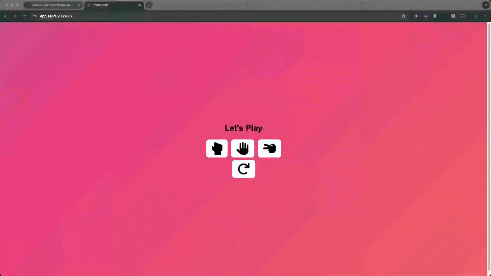
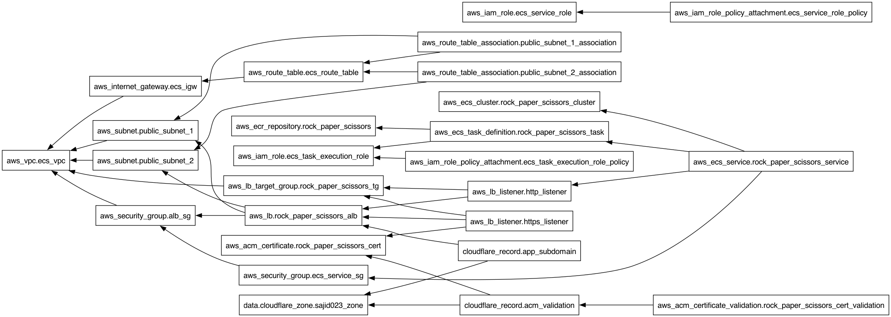

# Terraform AWS ECR ECS ALB Pipeline

This project provides an end-to-end solution for deploying a containerised application using AWS services. The pipeline utilises **Terraform** to provision and manage infrastructure on AWS, including **ECR**, **ECS**, **ALB**, and **Cloudflare** for DNS management. It includes a **CI/CD** pipeline to automate the build and deployment of the Dockerised application using **GitHub Actions**.

# Table of Contents

1. [Project Overview](#project-overview)
2. [App Demo](#app-demo)
3. [Architecture](#architecture)
4. [Prerequisites](#prerequisites)
5. [Project Structure](#project-structure)
6. [Setup Instructions](#setup-instructions)

   - [Clone Repository](#clone-repository)
   - [Configuration](#configuration)
   - [Initialise Terraform](#initialise-terraform)
   - [Deploy Infrastructure](#deploy-infrastructure)
   - [Clean Up](#clean-up)

7. [SSL/TLS Certificate Setup](#ssltls-certificate-setup)
8. [Variables](#variables)
9. [Outputs](#outputs)
10. [CI/CD with GitHub Actions](#cicd-with-github-actions)
11. [Contributing](#contributing)
12. [License](#license)

## Project Overview

This Terraform project automates the deployment of a containerised application in AWS using the following services:

- **Amazon Elastic Container Registry (ECR)**: Stores the Docker image.
- **Amazon Elastic Container Service (ECS)**: Orchestrates the containerised application.
- **Application Load Balancer (ALB)**: Routes traffic to ECS services.
- **AWS Certificate Manager (ACM)**: Manages SSL certificates.
- **Cloudflare**: Manages DNS for custom domains.

## App Demo



## Architecture



The project sets up the following AWS infrastructure using Terraform:

1.  **ECR**

    - Private Repository (`aws_ecr_repository.rock_paper_scissors`): The repository stores the Docker image for the application, ensuring secure and scalable storage for container image.

2.  **ECS**

    - ECS Cluster (`aws_ecs_cluster.rock_paper_scissors_cluster`): The cluster manages the Docker container running the rock-paper-scissors app.
    - **Task Definition** (`aws_ecs_task_definition.rock_paper_scissors_task`): Specifies the Docker container details, such as the image, memory, CPU requirements, and networking settings.
    - ECS Service (`aws_ecs_service.rock_paper_scissors_service`): Ensures the specified number of task instances are running, and integrates with the ALB to route traffic to the Docker container.

3.  **ALB**

    - Load Balancer (`aws_lb.rock_paper_scissors_alb`): Distributes incoming traffic across multiple instances of the application, ensuring availability and scalability.
    - Target Group (`aws_lb_target_group.rock_paper_scissors_tg`): Manages the routing of requests to the ECS service. It monitors the health of tasks and redirects traffic to healthy targets.
    - Listeners (`aws_lb_listener.http_listener`, `aws_lb_listener.https_listener`): Listens for HTTP and HTTPS traffic, ensuring both secure and non-secure communication to the application.

4.  **ACM**

    - SSL Certificate (`aws_acm_certificate.rock_paper_scissors_cert`): Ensures secure communication via HTTPS by managing SSL certificates. The ALB uses this certificate to encrypt traffic.
    - Certificate Validation (`aws_acm_certificate_validation.rock_paper_scissors_cert_validation`): Automates the process of validating the SSL certificate via DNS, ensuring that the certificate is trusted.

5.  **Cloudflare**

    - DNS Configuration (`cloudflare_record.app_subdomain, cloudflare_record.acm_validation`): Manages DNS records for the subdomain `app.sajid023.co.uk`, pointing traffic to the AWS load balancer and validating SSL certificates via Cloudflare's DNS.
    - Subdomain Setup (`data.cloudflare_zone.sajid023_zone`): Ensures the subdomain for the application is correctly configured and pointing to the ALB.

6.  **Networking**

    - VPC (`aws_vpc.ecs_vpc`): The Virtual Private Cloud isolates the application infrastructure, providing security and control over network traffic.
    - Subnets (`aws_subnet.public_subnet_1`, `aws_subnet.public_subnet_2`): These public subnets allow the ECS service to interact with the internet through the ALB.
    - Internet Gateway (`aws_internet_gateway.ecs_igw`): Connects the VPC to the internet, enabling inbound and outbound traffic to the public subnets.
    - Route Tables and Associations: Ensure that traffic from the internet can reach the resources in the public subnets via the Internet Gateway.

7.  **Security Groups**

    - ALB Security Group (`aws_security_group.alb_sg`): Controls inbound and outbound traffic to the Application Load Balancer, ensuring that only HTTP and HTTPS is allowed.
    - ECS Security Group (`aws_security_group.ecs_service_sg`): Restricts traffic to the ECS service to ensure secure communication between the load balancer and the ECS tasks.

8.  **IAM Roles and Policies**
    - IAM Role for ECS Task Execution (`aws_iam_role.ecs_task_execution_role`): Grants ECS tasks permissions to pull the image from ECR and interact with other AWS resources.
    - IAM Role for ECS Service (`aws_iam_role.ecs_service_role`): Manages permissions for the ECS service, enabling it to interact with the ALB and other AWS services.
    - IAM Policies and Attachments: Policies attached to the IAM roles ensure that the ECS tasks and services have the necessary permissions to operate securely within the environment.

## Prerequisites

Ensure you have the following tools installed:

- Terraform (v1.0 or later)
- AWS CLI (configured with appropriate credentials)
- Docker
- GitHub Actions
- Cloudflare account

  
[](https://aws.amazon.com/) [](https://www.terraform.io/)  


## Project Structure


## Setup Instructions

### Clone Repository

```
git clone https://github.com/sohailsajid79/terraform-aws-ecr-ecs-alb-pipeline.git
cd terraform-aws-ecr-ecs-alb-pipeline
```

### Configuration

1. Ensure [AWS CLI](https://awscli.amazonaws.com/v2/documentation/api/latest/reference/configure/index.html) is configured

```
  aws configure
```

2. Set Global Cloudflare API key and email as environment variables


Create a terraform.tfvars file and add the Cloudflare credentials:

```
cloudflare_email = "email@example.com"
cloudflare_api_key = "api-token"
```

🚨 Do not commit terraform.tfvars to version control and keep API key secure by adding it to .gitignore 🚨

## Initialise Terraform

```
terraform init
```

## Deploy Infrastructure

❗ The ECR must be deployed before triggering the CI/CD pipeline to build and push the Docker image to ECR.❗

```
terraform apply -target=aws_ecr_repository.rock_paper_scissors_app -auto-approve
```

```
terraform apply -auto-approve
```

## Clean Up

❗ Terraform destroy will clean up the infrastructure, but the Docker image stored in the ECR is not tracked by Terraform state. You need to manually delete the Docker image via the AWS Console or AWS CLI ❗

Delete ECR repository and the docker image:

```
aws ecr delete-repository --repository-name rock-paper-scissors-app --force
```

```
terraform destroy -auto-approve
```

## SSL/TLS Certificate Setup

To secure the application using HTTPS, obtain an SSL/TLS certificate by either using a third-party Certificate Authority (CA) or generate your own self-signed certificate for development purposes. I opted to generate a self-signed certificates using OpenSSL for the load balancer:

```
openssl req -x509 -nodes -days 365 -newkey rsa:2048 \
-keyout private.key \
-out public.crt \
-subj "/C=US/ST=State/L=City/O=Organization/CN=rock-paper-scissors-alb"
```

Upload to AWS IAM:

```
aws iam upload-server-certificate \
  --server-certificate-name "my-self-signed-cert" \
  --certificate-body file://public.crt \
  --private-key file://private.key
```

## Variables

| Variable             | Description              | Default      | Store                              |
| -------------------- | ------------------------ | ------------ | ---------------------------------- |
| `region`             | AWS region               | `eu-north-1` |
| `cloudflare_email`   | Cloudflare account email | `sensitive`  | store in terraform.tfvars          |
| `cloudflare_api_key` | Cloudflare API token     | `sensitive`  | store API keys in terraform.tfvars |

## Outputs

This project outputs the following:

| Output                  | Description                                                            |
| ----------------------- | ---------------------------------------------------------------------- |
| `alb_dns_name`          | DNS name of the Application Load Balancer (ALB) (HTTP)                 |
| `alb_https_dns_name`    | DNS name of the Application Load Balancer (ALB) (HTTPS)                |
| `alb_security_group_id` | Security Group ID for the Application Load Balancer                    |
| `ecr_repository_arn`    | Amazon Resource Name (ARN) for the ECR repository                      |
| `ecr_repository_url`    | URL of the ECR repository for Docker image pushes                      |
| `internet_gateway_id`   | ID of the Internet Gateway associated with the VPC                     |
| `subnet_public_1_id`    | ID of the first public subnet                                          |
| `subnet_public_2_id`    | ID of the second public subnet                                         |
| `vpc_id`                | VPC ID of the Virtual Private Cloud (VPC) where resources are deployed |

## CI/CD with GitHub Actions

This repository includes a CI/CD pipeline using GitHub Actions with the workflow defined in `.github/workflows/ci-cd.yml`. The workflow automates the build and push Docker image to ECR. Sensitive credentials (e.g., AWS keys) are stored in GitHub Secrets for secure access in the CI pipeline.

[](https://github.com/sohailsajid79/terraform-aws-ecr-ecs-alb-pipeline/actions/workflows/ci-cd.yaml)

```
- name: Configure AWS Credentials
        uses: aws-actions/configure-aws-credentials@v1
        with:
          aws-access-key-id: ${{ secrets.AWS_ACCESS_KEY_ID }}
          aws-secret-access-key: ${{ secrets.AWS_SECRET_ACCESS_KEY }}
          aws-region: ${{ secrets.AWS_REGION }}

      - name: Log in to Amazon ECR
        id: login-ecr
        uses: aws-actions/amazon-ecr-login@v1

      - name: Set up Docker Buildx
        uses: docker/setup-buildx-action@v2

      - name: Build Docker image
        run: |
          docker build -t rock-paper-scissors-app .
          docker tag rock-paper-scissors-app:latest ${{ steps.login-ecr.outputs.registry }}/rock-paper-scissors-app:latest

      - name: Push Docker image to ECR
        run: |
          docker push ${{ steps.login-ecr.outputs.registry }}/rock-paper-scissors-app:latest

      - name: Output image URL
        run: |
          echo "Image URL: ${{ steps.login-ecr.outputs.registry }}/rock-paper-scissors-app:latest"
```

## Contributing

I welcome contributions! If you have suggestions for improvements or bugs please open an issue or submit a pull request.

## License

This project is licensed under the MIT License.
